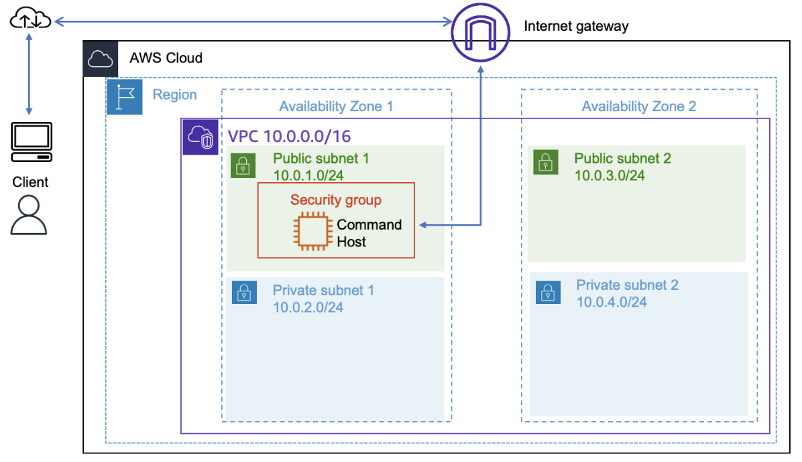

# ☁️ AWS Auto Scaling Lab

Projeto desenvolvido durante laboratório da AWS utilizando Amazon EC2, Auto Scaling, Elastic Load Balancer e AWS CLI.

---

## 📖 Sobre

Neste laboratório foi criada uma infraestrutura altamente disponível capaz de aumentar e reduzir automaticamente a quantidade de servidores conforme a carga da aplicação.

O ambiente utiliza:

- Amazon EC2
- Amazon Machine Image (AMI)
- AWS CLI
- Launch Template
- Auto Scaling Group
- Application Load Balancer
- CloudWatch

---

## Arquitetura

### Inicial



### Final


---

## Tecnologias

- AWS EC2
- AWS CLI
- Auto Scaling
- Elastic Load Balancer
- CloudWatch
- Linux

---

## Objetivos

- Criar uma instância EC2 via AWS CLI
- Criar uma AMI personalizada
- Criar um Launch Template
- Configurar um Auto Scaling Group
- Distribuir carga utilizando Application Load Balancer
- Automatizar Scale Out e Scale In através do CloudWatch

---

## Etapas do Projeto

### 1. Criação da EC2

Foi criada uma instância Linux utilizando AWS CLI.

```bash
aws ec2 run-instances
```

---

### 2. Criação da AMI

Após configurar o servidor web foi criada uma imagem personalizada.

```bash
aws ec2 create-image
```

---

### 3. Application Load Balancer

Foi criado um ALB para distribuir requisições entre múltiplas instâncias.

Recursos utilizados:

- HTTP
- Target Group
- Health Check

---

### 4. Launch Template

Configuração padrão utilizada pelo Auto Scaling Group.

Incluindo:

- AMI personalizada
- Tipo t3.micro
- Security Group
- Configuração de rede

---

### 5. Auto Scaling

Configuração:

| Configuração | Valor |
|-------------|-------|
| Desired | 2 |
| Minimum | 2 |
| Maximum | 4 |
| Target CPU | 50% |

---

### 6. Teste

Foi utilizado o script disponibilizado pela aplicação para gerar alto consumo de CPU.

Quando a CPU ultrapassou 50%:

✅ Nova instância criada automaticamente.

Quando a carga reduziu:

✅ Instâncias extras removidas automaticamente.

---

## Fluxo

EC2

↓

AMI

↓

Launch Template

↓

Auto Scaling Group

↓

Application Load Balancer

↓

CloudWatch monitora CPU

↓

Scale Out / Scale In

---

## Aprendizados

Durante este laboratório foi possível praticar:

- AWS CLI
- Provisionamento de EC2
- Criação de imagens AMI
- Balanceamento de carga
- Escalabilidade automática
- Monitoramento utilizando CloudWatch

---

## Autor

Pedro Henrique

Técnico em Redes de Computadores

Infraestrutura • Cloud • AWS • Linux
